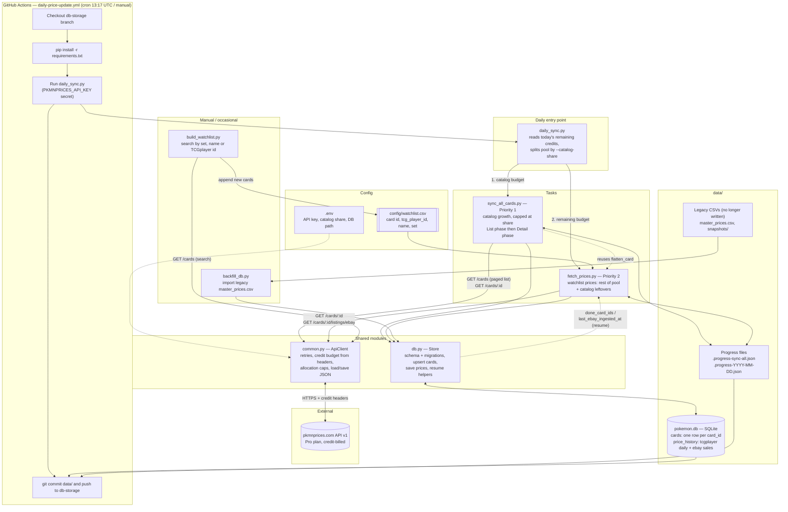

# Architecture

```mermaid
flowchart TB
    subgraph CI["GitHub Actions — daily-price-update.yml (cron 13:17 UTC / manual)"]
        GA1["Checkout db-storage branch"] --> GA2["pip install -r requirements.txt"]
        GA2 --> GA3["Run daily_sync.py<br/>(PKMNPRICES_API_KEY secret)"]
        GA3 --> GA4["git commit data/ and push to db-storage"]
    end

    subgraph EXT["External"]
        API[("pkmnprices.com API v1<br/>Pro plan, credit-billed")]
    end

    subgraph CFG["Config"]
        ENV[".env<br/>API key, catalog share, DB path"]
        WL[["config/watchlist.csv<br/>card id, tcg_player_id, name, set"]]
    end

    subgraph CORE["Shared modules"]
        COMMON["common.py — ApiClient<br/>retries, credit budget from headers,<br/>allocation caps, load/save JSON"]
        DBPY["db.py — Store<br/>schema + migrations, upsert cards,<br/>save prices, resume helpers"]
    end

    subgraph ORCH["Daily entry point"]
        DS["daily_sync.py<br/>reads today's remaining credits,<br/>splits pool by --catalog-share"]
    end

    subgraph TASKS["Tasks"]
        SAC["sync_all_cards.py — Priority 1<br/>catalog growth, capped at share<br/>List phase then Detail phase"]
        FP["fetch_prices.py — Priority 2<br/>watchlist prices: rest of pool<br/>+ catalog leftovers"]
    end

    subgraph TOOLS["Manual / occasional"]
        BW["build_watchlist.py<br/>search by set, name or TCGplayer id"]
        BF["backfill_db.py<br/>import legacy master_prices.csv"]
    end

    subgraph DATA["data/"]
        PDB[("pokemon.db — SQLite<br/>cards: one row per card_id<br/>price_history: tcgplayer daily + ebay sales")]
        PROG["Progress files<br/>.progress-sync-all.json<br/>.progress-YYYY-MM-DD.json"]
        LEG["Legacy CSVs (no longer written)<br/>master_prices.csv, snapshots/"]
    end

    GA3 --> DS
    ENV -.-> COMMON
    DS -->|"1. catalog budget"| SAC
    DS -->|"2. remaining budget"| FP

    SAC -->|"GET /cards (paged list)<br/>GET /cards/:id"| COMMON
    FP -->|"GET /cards/:id<br/>GET /cards/:id/listings/ebay"| COMMON
    BW -->|"GET /cards (search)"| COMMON
    COMMON <-->|"HTTPS + credit headers"| API

    WL --> FP
    BW -->|"append new cards"| WL
    SAC -. "reuses flatten_card" .-> FP

    SAC --> DBPY
    FP --> DBPY
    BF --> DBPY
    LEG --> BF
    DBPY <--> PDB

    SAC <--> PROG
    FP <--> PROG
    DBPY -. "done_card_ids /<br/>last_ebay_ingested_at (resume)" .-> FP

    PDB --> GA4
    PROG --> GA4
```
