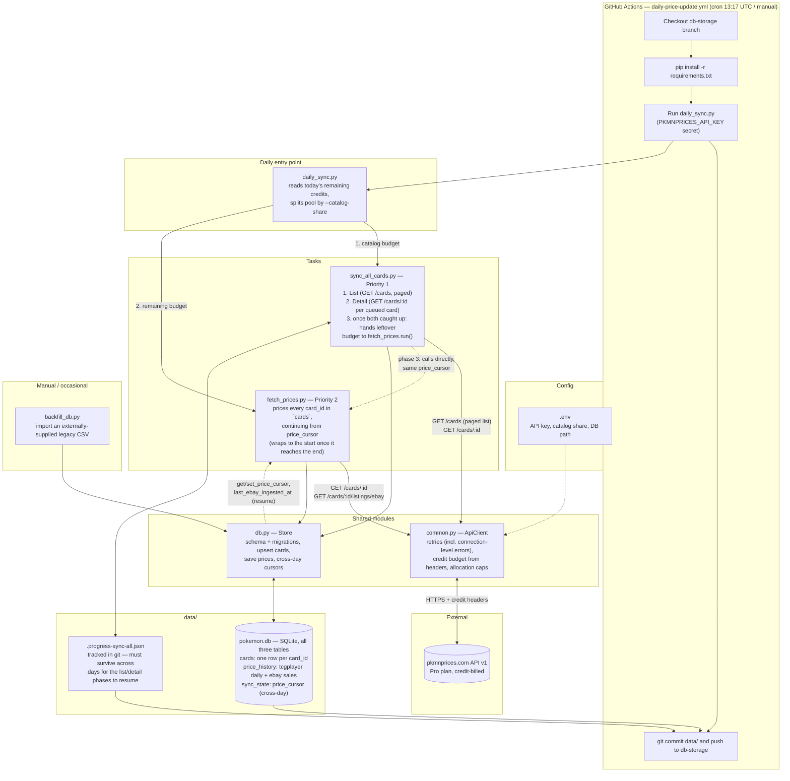

# Architecture

```mermaid
flowchart TB
    subgraph CI["GitHub Actions — daily-price-update.yml (cron 13:17 UTC / manual)"]
        GA1["Checkout db-storage branch"] --> GA2["pip install -r requirements.txt"]
        GA2 --> GA3["Run daily_sync.py<br/>(PKMNPRICES_API_KEY secret)"]
        GA3 --> GA4["git commit data/ and push to db-storage"]
    end

    subgraph EXT["External"]
        API[("pkmnprices.com API v1<br/>Pro plan, credit-billed")]
    end

    subgraph CFG["Config"]
        ENV[".env<br/>API key, catalog share, DB path"]
    end

    subgraph CORE["Shared modules"]
        COMMON["common.py — ApiClient<br/>retries (incl. connection-level errors),<br/>credit budget from headers, allocation caps"]
        DBPY["db.py — Store<br/>schema + migrations, upsert cards,<br/>save prices, cross-day cursors"]
    end

    subgraph ORCH["Daily entry point"]
        DS["daily_sync.py<br/>reads today's remaining credits,<br/>splits pool by --catalog-share"]
    end

    subgraph TASKS["Tasks"]
        SAC["sync_all_cards.py — Priority 1<br/>1. List (GET /cards, paged)<br/>2. Detail (GET /cards/:id per queued card)<br/>3. once both caught up: hands leftover<br/>budget to fetch_prices.run()"]
        FP["fetch_prices.py — Priority 2<br/>prices every card_id in `cards`,<br/>continuing from price_cursor<br/>(wraps to the start once it reaches the end)"]
    end

    subgraph TOOLS["Manual / occasional"]
        BF["backfill_db.py<br/>import an externally-supplied legacy CSV"]
    end

    subgraph DATA["data/"]
        PDB[("pokemon.db — SQLite, all three tables<br/>cards: one row per card_id<br/>price_history: tcgplayer daily + ebay sales<br/>sync_state: price_cursor (cross-day)")]
        PROG[".progress-sync-all.json<br/>tracked in git — must survive across<br/>days for the list/detail phases to resume"]
    end

    GA3 --> DS
    ENV -.-> COMMON
    DS -->|"1. catalog budget"| SAC
    DS -->|"2. remaining budget"| FP

    SAC -->|"GET /cards (paged list)<br/>GET /cards/:id"| COMMON
    FP -->|"GET /cards/:id<br/>GET /cards/:id/listings/ebay"| COMMON
    COMMON <-->|"HTTPS + credit headers"| API

    SAC -. "phase 3: calls directly,<br/>same price_cursor" .-> FP

    SAC --> DBPY
    FP --> DBPY
    BF --> DBPY
    DBPY <--> PDB

    SAC <--> PROG
    DBPY -. "get/set_price_cursor,<br/>last_ebay_ingested_at (resume)" .-> FP

    PDB --> GA4
    PROG --> GA4
```
